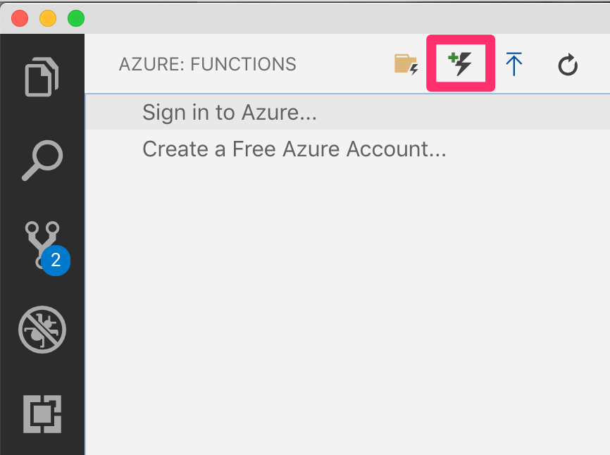

# Azure Function Web API secured by Azure AD

This code example demonstrates how to secure an Azure function with Azure AD when the function uses HTTPTrigger and exposes a Web API. The Web API is written using expressjs, and the authentication is provided by passport-azure-ad.

This readme walks you through the steps of setting up such a function from scratch. While you can develop Azure functions in many ways, such as Visual Studio 2019, Visual Studio Code, etc. this guide shows how to perform the steps using Visual Studio Code.

## Prerequisites
1. You must have Visual Studio Code installed
2. You must have Azure Functions core tools installed `npm install -g azure-functions-core-tools`
3. Azure functions VSCode extension (https://marketplace.visualstudio.com/items?itemName=ms-azuretools.vscode-azurefunctions)

There are two main parts here,

a) Writing the project and get things running locally

b) Deploy to an Azure subscription.

But before we do either of these, we will need an AAD app that will act as the function Web API registration.

## Register an AAD App

Reference: [How to register an app](https://docs.microsoft.com/en-nz/azure/active-directory/develop/quickstart-register-app)

The Azure function acts as a WebAPI. 

Register a new app, with the following redirect URIs,
For local testing - 
```
  http://localhost:7071/callback
  http://localhost:7071
```

For testing in Azure (this must match your Azure functions URL which you will create later in this tutorial) - 
```
  https://<yournodejsfunction>.azurewebsites.net/callback
  https://<yournodejsfunction>.azurewebsites.net
```
Note down it's application id. I will refer to this application id as `client_id_api` for the purposes of this document.

Also choose to generate a client secret - save it somewhere, you'll need it soon.

Also save the app id URI of this app. 
[How to get the AppID URI]('./glossary/how to get app id uri.md')

## Author the project

1. First create a new project `func init SecureAPI`, choose to `node` as your worker runtime, and `JavaScript` as the language
2. Next open this folder in VSCode, and choose to add a new function as shown below. You may be asked to intialize the project for VSCode, choose yes.
 
  
 This will ask you to initialize the project for use with VSCode, choose Yes.
3. Next, create a package.json file in your functions project and add the following
``` json
{
    "dependencies": {
        "azure-functions-core-tools": "^2.5.553",
        "azure-function-express": "^2.0.0",
        "body-parser": "^1.18.3",
        "connect-ensure-login": "^0.1.1",
        "cookie-parser": "^1.4.4",
        "ejs": "^2.6.1",
        "express": "^4.16.4",
        "express-session": "^1.15.6",
        "morgan": "^1.9.1",
        "passport": "^0.4.0",
        "passport-azure-ad": "^4.0.0"
    }
}
```
4. Run `npm install` and verify that after running npm install, you get a package-lock.json file and a node_modules folder created.
5. Now, add a function using `func new -l JavaScript -n MyHttpTrigger -t "HTTP Trigger"` verify that it writes out a folder called MyHttpTrigger with an index.js, function.json and sample.dat files.
6. In the index.js file, add the following code, note that this is a simple expressjs app, also note that while I have chosen to embed the client ID etc. within my code for simplicity, in real world applications, you want to externalize this configuration information.

``` javascript
const createHandler = require("azure-function-express").createHandler;
const express = require("express");
const passport = require('passport');

var tenantID = "<tenantid>";
var clientID = "<clientid>";
var appIdURI = "<appiduri>";

var options = {
    identityMetadata: "https://login.microsoftonline.com/" + tenantID + "/v2.0/.well-known/openid-configuration",
    clientID: clientID,
    issuer: "https://sts.windows.net/" + tenantID + "/",
    audience: appIdURI,
    loggingLevel: "info",
    passReqToCallback: false
};

var bearerStrategy = new BearerStrategy(options, function (token, done) {
    done(null, {}, token);
});

const app = express();

app.use(require('morgan')('combined'));
app.use(require('body-parser').urlencoded({"extended":true}));
app.use(passport.initialize());
passport.use(bearerStrategy);

// This is where your API methods are exposed
app.get(
    "/api",
    passport.authenticate("oauth-bearer", { session: false }),
    function (req, res) {
        var claims = req.authInfo;
        console.log("Validated claims: ", JSON.stringify(claims));
        console.log("body text: ", JSON.stringify(req.body));
        res.status(200).json(claims);
    }
);

module.exports = createHandler(app);
```
7. Also, modify the function.json file as below,
``` json
{
  "bindings": [
    {
      "authLevel": "anonymous",
      "type": "httpTrigger",
      "direction": "in",
      "name": "req",
      "route": "{*segments}",
      "methods": [
        "get",
        "post"
      ]
    },
    {
      "type": "http",
      "direction": "out",
      "name": "res"
    }
  ]
}
```
The main changes done here are as follows, 
 - We have changed the authLevel to anonymous, effectively telling the functions runtime that we are taking on authentication, and we don't want functions runtime to do any kind of authentication for us.
 - We have changed the route to allow any segment, so we can accept callbacks at any URL. Within our Express app however, we can handle 404s 401s etc. if necessary.

 8. All done, lets test it!

 ## Test your function - locally

 1. With the project open in VSCode, just hit F5, or you can also run `func host start` from the CLI.
 2. You will need an access token to call this function. In order to get the access token, open browser in private mode and visit
 ```
 https://login.microsoftonline.com/<tenant_name>.onmicrosoft.com/oauth2/v2.0/authorize?response_type=code&client_id=<client_id_api>&redirect_uri=http://localhost:7071/callback&scope=openid
```

This will prompt you to perform authentication, and it will return a code. 
Use that code in the following request to get an access token, remember to put in the code and client secret.

```
curl -X POST \
  https://login.microsoftonline.com/<tenant_name>.onmicrosoft.com/oauth2/v2.0/token \
  -H 'Accept: */*' \
  -H 'Cache-Control: no-cache' \
  -H 'Connection: keep-alive' \
  -H 'Content-Type: application/x-www-form-urlencoded' \
  -H 'Host: login.microsoftonline.com' \
  -H 'accept-encoding: gzip, deflate' \
  -H 'cache-control: no-cache' \
  -d 'redirect_uri=http%3A%2F%2Flocalhost:7071%2Fcallback&client_id=<client_id_api>&grant_type=authorization_code&code=<put code here>&client_secret=<put client secret here>&scope=https%3A%2F%2Fmytestapp.<tenant_name>.onmicrosoft.com%2F.default'
  ```
 
 3. Once you get the access token, make a GET request to `http://localhost:7071/api` with the access token as a Authorization Bearer header. Verify that you get the following output - 
 ``` JSON
{
    "aud": "https://mytestapp1.<tenant>.onmicrosoft.com",
    "iss": "https://sts.windows.net/<tenantid>/",
    "iat": 1560349450,
    "nbf": 1560349450,
    "exp": 1560353350,
    "acr": "1",
    "aio": "..removed..",
    "amr": [
        "pwd"
    ],
    "appid": "<clientid>",
    "appidacr": "1",
    "email": "..removed..",
    "family_name": "Malik",
    "given_name": "Sahil",
    "idp": "live.com",
    "ipaddr": "<removed..>",
    "name": "Sahil Malik",
    "oid": "<..removed..>",
    "sub": "<..removed..>",
    "tid": "<tenantid>",
    "unique_name": "..removed..",
    "uti": "..removed..",
    "ver": "1.0"
}
```

 ## Test your function - in Azure

 1. Go ahead and create a function app in azure, ensure that you pick nodejs as it's runtime and under platform features\configuration, set the `WEBSITE_DEFAULT_NODE_VERSION` to 10.14.1 (or whatever version you are using)
 2. Choose to deploy the function
 
 3. You will need an access token to call this function. In order to get the access token, open browser in private mode and visit
 ```
 https://login.microsoftonline.com/<tenant_name>.onmicrosoft.com/oauth2/v2.0/authorize?response_type=code&client_id=<client_id_api>&redirect_uri=https://<yournodejsfunction>.azurewebsites.net/callback&scope=openid
```

This will prompt you to perform authentication, and it will return a code. 
Use that code in the following request to get an access token, remember to put in the code and client secret.

```
curl -X POST \
  https://login.microsoftonline.com/<tenant_name>.onmicrosoft.com/oauth2/v2.0/token \
  -H 'Accept: */*' \
  -H 'Cache-Control: no-cache' \
  -H 'Connection: keep-alive' \
  -H 'Content-Type: application/x-www-form-urlencoded' \
  -H 'Host: login.microsoftonline.com' \
  -H 'accept-encoding: gzip, deflate' \
  -H 'cache-control: no-cache' \
  -d 'redirect_uri=https%3A%2F%2F<yournodejsfunction>.azurewebsites.net%2Fcallback&client_id=<client_id_api>&grant_type=authorization_code&code=<put code here>&client_secret=<put client secret here>&scope=https%3A%2F%2Fmytestapp.<tenant_name>.onmicrosoft.com%2F.default'
  ```
 
 3. Once you get the access token, make a GET request to `https://<yournodejsfunction>.azurewebsites.net/api` with the access token as a Authorization Bearer header. Verify that you get the following output - 
 ``` JSON
{
    "aud": "https://mytestapp1.<tenant>.onmicrosoft.com",
    "iss": "https://sts.windows.net/<tenantid>/",
    "iat": 1560349450,
    "nbf": 1560349450,
    "exp": 1560353350,
    "acr": "1",
    "aio": "..removed..",
    "amr": [
        "pwd"
    ],
    "appid": "<clientid>",
    "appidacr": "1",
    "email": "..removed..",
    "family_name": "Malik",
    "given_name": "Sahil",
    "idp": "live.com",
    "ipaddr": "<removed..>",
    "name": "Sahil Malik",
    "oid": "<..removed..>",
    "sub": "<..removed..>",
    "tid": "<tenantid>",
    "unique_name": "..removed..",
    "uti": "..removed..",
    "ver": "1.0"
}
```
